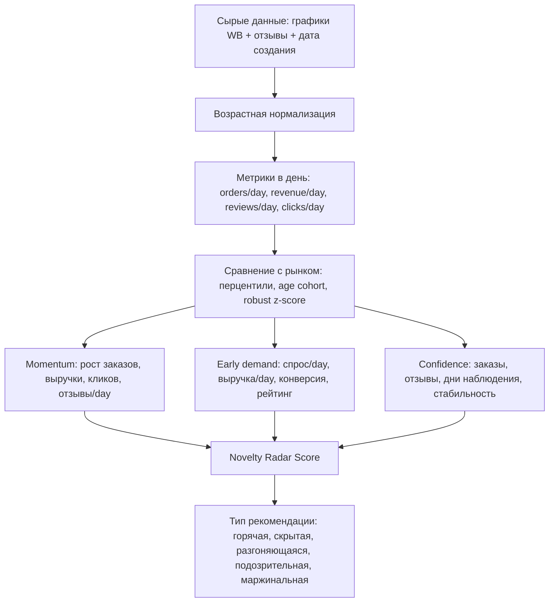

# Схема рекомендаций: радар новинок

Основано на методике из shared-чата: https://chatgpt.com/share/6a428b7b-ffcc-83eb-b460-2367f8a4f48a

## Логика

Схема не ищет просто самые новые или самые большие карточки. Она ищет карточки, которые сильны относительно своего возраста и имеют объяснимые признаки раннего спроса.



## Формулы

- `active_observed_days = min(card_age_days, chart_period_days)`.
- `orders_per_day = orders_total / active_observed_days`.
- `revenue_per_day = revenue_total / active_observed_days`.
- `reviews_per_day = reviews_count / card_age_days`.
- Для кривых WB используем перцентили, а не средние, потому что распределения перекошены несколькими гигантами.
- Для конверсии и выкупа используется Bayesian smoothing, чтобы молодые карточки с малой базой не улетали наверх случайно.

Итоговый `novelty_radar_score`:

```text
0.20 * age_score
+ 0.20 * orders_per_day_pct
+ 0.15 * revenue_per_day_pct
+ 0.15 * momentum_score
+ 0.10 * reviews_per_day_pct
+ 0.10 * conversion_score
+ 0.05 * visibility_score
+ 0.05 * confidence_score
```

Возраст не доминирует: молодость даёт плюс, но карточка должна доказать спросом, кликами, конверсией и выкупом, что она не пустая.

## Классификация

- `горячая новинка`: молодая карточка с очень высоким спросом/day, выручкой/day и быстрым набором отзывов.
- `скрытая новинка`: молодая карточка с заказами, хорошей конверсией и отзывами не выше медианы своей возрастной группы.
- `разгоняющаяся новинка`: молодая карточка с высоким momentum и ростом текущих заказов.
- `подозрительная новинка`: молодая карточка с аномально многими отзывами, но слабым спросом/day.
- `новинка с маржинальным потенциалом`: молодая карточка с ценой выше медианы, хорошей выручкой/day и нормальной конверсией.

## Top 15 По Novelty Radar

| novelty_radar_rank | nm_id | name | recommendation_type | score | age | reviews | orders_day | growth | conv | conf |
| --- | --- | --- | --- | --- | --- | --- | --- | --- | --- | --- |
| 1.0 | 918057411 | Блендер погружной мощный кухонный | перспективная молодая карточка | 82.2 | 94 | 5 363 | 87.1 | -91.1 | 5.07 | 90 |
| 2.0 | 767075015 | Блендер портативный для смузи и коктейлей 2 в 1 | перспективная молодая карточка | 78.3 | 161 | 1 871 | 124.6 | -2.8 | 3.64 | 92 |
| 3.0 | 158525642 | Блендер погружной измельчитель 3 в 1 | сильный зрелый лидер | 76.6 | 1 161 | 23 642 | 150.2 | -5.2 | 4.68 | 97 |
| 4.0 | 706082247 | Блендер ручной погружной Bt HB721SS Черно-серый | средневозрастной кандидат | 72.9 | 196 | 2 579 | 80.1 | -17.6 | 4.40 | 89 |
| 5.0 | 827570318 | Блендер портативный для смузи и коктейлей 2 в 1 | перспективная молодая карточка | 71.5 | 135 | 1 871 | 67.8 | -21.4 | 3.56 | 91 |
| 6.0 | 1088308702 | Погружной блендер кухонный 4 в 1 | разгоняющаяся новинка | 71.4 | 34 | 403 | 27.3 | 349.1 | 2.98 | 48 |
| 7.0 | 554546424 | Блендер погружной мощный с чашей и стаканом 4в1 | средневозрастной кандидат | 70.4 | 267 | 993 | 63.3 | -2.2 | 3.24 | 88 |
| 8.0 | 525020543 | Блендер стационарный с кофемолкой 1200 Вт | средневозрастной кандидат | 69.5 | 294 | 1 062 | 50.1 | 47.8 | 4.96 | 86 |
| 9.0 | 844743357 | Блендер портативный для смузи и коктейлей | перспективная молодая карточка | 65.8 | 126 | 855 | 37.5 | 0.2 | 3.37 | 85 |
| 10.0 | 585130046 | Стационарный блендер для смузи и коктейлей | средневозрастной кандидат | 64.2 | 244 | 7 211 | 42.6 | -53.4 | 1.75 | 90 |
| 11.0 | 262683065 | Блендер для смузи стационарный 2 в 1 мощный | обычная карточка | 64.0 | 648 | 1 812 | 68.2 | -27.8 | 4.10 | 88 |
| 12.0 | 845020313 | Блендер портативный для смузи и коктейлей 2 в 1 | перспективная молодая карточка | 63.0 | 126 | 1 871 | 36.8 | -16.9 | 2.32 | 87 |
| 13.0 | 1032349251 | Портативный блендер для смузи и коктейлей | перспективная молодая карточка | 62.8 | 45 | 231 | 31.6 | -17.4 | 1.73 | 70 |
| 14.0 | 291892830 | Блендер погружной мощный, кухонный комбайн для смузи | обычная карточка | 62.1 | 580 | 2 052 | 33.9 | -5.0 | 1.53 | 86 |
| 15.0 | 897114209 | Блендер погружной мощный 5 в 1 с чашей и капучинатором | разгоняющаяся новинка | 60.4 | 103 | 403 | 22.2 | 6.7 | 2.80 | 80 |

## Сколько карточек по типам

| recommendation_type | cards |
| --- | --- |
| обычная карточка | 35 |
| перспективная молодая карточка | 6 |
| средневозрастной кандидат | 4 |
| сильный зрелый лидер | 3 |
| разгоняющаяся новинка | 2 |

Полная таблица: `reports/novelty_recommendation_radar_2026-06-29.csv`.
